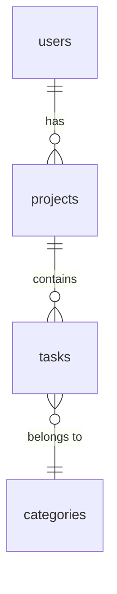

# Supabase Data Map

Skanuje projekt pod kątem struktury bazy danych Supabase i generuje mapę: tabele, kolumny, relacje, RLS policies, Edge Functions. Claude wie gdzie szukać danych zamiast pytać.

## Kiedy używać

- Na początku pracy z nowym projektem (onboarding)
- Gdy agent nie wie w której tabeli szukać danych
- Na żądanie: "mapa danych", "schemat bazy", "pokaż tabele", "data map", "przeskanuj bazę"
- Po dodaniu migracji — zaktualizuj mapę
- Przy planowaniu nowych features — żeby znać istniejące relacje

## Kiedy NIE używać

- Projekt nie używa Supabase
- Baza jest pusta (brak migracji)
- Użytkownik prosi o konkretne zapytanie SQL (wtedy po prostu napisz SQL)

## Instrukcje

### Krok 1: Zlokalizuj migracje

```bash
# Szukaj plików migracji Supabase
find . -path "*/supabase/migrations/*.sql" -type f | sort
# Alternatywnie
ls supabase/migrations/ 2>/dev/null || ls migrations/ 2>/dev/null
```

Jeśli brak migracji lokalnie — sprawdź czy jest `supabase/config.toml` lub połączenie remote.

### Krok 2: Wyodrębnij strukturę

Przeczytaj KAŻDY plik migracji (chronologicznie) i wyodrębnij:

#### Tabele
```
Tabela: [nazwa]
├── Kolumny: [nazwa] [typ] [constraints]
├── RLS: enabled/disabled
├── Policies: [nazwa] → [operacja] FOR [rola] USING ([warunek])
├── Indexes: [nazwa] ON [kolumny]
├── Triggers: [nazwa] → [funkcja]
└── Uwagi: [np. "junction table", "audit log", "lookup"]
```

#### Relacje (Foreign Keys)
```
[tabela_A].[kolumna] → [tabela_B].[kolumna] (ON DELETE [akcja])
```

#### Funkcje i Triggery
```
Funkcja: [nazwa]([parametry]) RETURNS [typ]
  SECURITY: DEFINER/INVOKER
  Cel: [co robi]
```

#### Edge Functions
```bash
ls supabase/functions/*/index.ts 2>/dev/null
```

### Krok 3: Analiza bezpieczeństwa

Dla KAŻDEJ tabeli sprawdź:

| Kontrola | Jak sprawdzić | Czerwona flaga |
|----------|---------------|----------------|
| RLS enabled | `ALTER TABLE ... ENABLE ROW LEVEL SECURITY` | Tabela z danymi użytkownika BEZ RLS |
| INSERT policy | Policy z operacją INSERT | Brak → użytkownicy nie mogą dodawać danych |
| SELECT policy | Policy z operacją SELECT | Brak → dane niewidoczne (nawet dla właściciela) |
| UPDATE/DELETE | Policy z warunkiem `auth.uid()` | Brak → ktokolwiek może edytować/usuwać |
| Service role bypass | Zapytania z service_role key | OK na serwerze, NIGDY na kliencie |

### Krok 4: Wygeneruj mapę

Zapisz wynik w `docs/DATA-MAP.md` w projekcie (lub wyświetl w konsoli):

```markdown
# Data Map — [nazwa projektu]
Ostatnia aktualizacja: [data]
Migracje: [X plików]

## Tabele ([ilość])

### [nazwa_tabeli]
| Kolumna | Typ | Nullable | Default | FK |
|---------|-----|----------|---------|-----|
| id | uuid | NIE | gen_random_uuid() | — |
| user_id | uuid | NIE | — | → auth.users(id) |
| ... | | | | |

**RLS:** ✅ Enabled
**Policies:**
- `select_own` → SELECT FOR authenticated USING (user_id = auth.uid())
- `insert_own` → INSERT FOR authenticated WITH CHECK (user_id = auth.uid())

---

## Relacje



## Bezpieczeństwo

| Tabela | RLS | SELECT | INSERT | UPDATE | DELETE | Status |
|--------|-----|--------|--------|--------|--------|--------|
| projects | ✅ | ✅ | ✅ | ✅ | ✅ | OK |
| settings | ❌ | — | — | — | — | ⚠️ BRAK RLS |

## Edge Functions ([ilość])
- `send-email` — wysyłka maili transakcyjnych
- `webhook-handler` — obsługa webhooków z Stripe
```

### Krok 5: Przyrostowa aktualizacja

Gdy dodawane są nowe migracje:
1. Przeczytaj TYLKO nowe pliki migracji (po ostatniej dacie aktualizacji mapy)
2. Dodaj nowe tabele/kolumny/relacje do istniejącej mapy
3. Zaktualizuj datę i liczbę migracji

## Pułapki

### ❌ Migracje nie odzwierciedlają stanu produkcji
**Objaw**: Mapa mówi "tabela X istnieje" ale na produkcji jej nie ma
**Przyczyna**: Migracja została stworzona lokalnie ale nie uruchomiona `supabase db push`
**Rozwiązanie**: Sprawdź `supabase migration list` lub porównaj z remote: `supabase db diff`

### ❌ ALTER TABLE nadpisuje wcześniejszy CREATE TABLE
**Objaw**: Mapa pokazuje starą strukturę kolumn
**Przyczyna**: Migracja 002 zmienia kolumny z migracji 001, agent czyta tylko 001
**Rozwiązanie**: Czytaj migracje CHRONOLOGICZNIE i nakładaj zmiany. ALTER TABLE > CREATE TABLE.

### ❌ RLS enabled ale brak policies
**Objaw**: Agent raportuje "RLS ✅" ale tabela jest nieczytelna
**Przyczyna**: `ENABLE ROW LEVEL SECURITY` bez żadnych policies = domyślny DENY ALL
**Rozwiązanie**: Sprawdź czy ENABLE RLS ma towarzyszące CREATE POLICY. Brak policies = CZERWONA FLAGA.

### ❌ Pomijanie widoków (views)
**Objaw**: Agent nie widzi danych które są dostępne przez view
**Przyczyna**: Views nie mają własnego RLS — dziedziczą z bazowych tabel
**Rozwiązanie**: Skanuj też `CREATE VIEW` / `CREATE OR REPLACE VIEW` i dokumentuj w mapie.

### ❌ Typ uuid vs text w FK
**Objaw**: Join zwraca puste wyniki
**Przyczyna**: Kolumna `user_id` w jednej tabeli to `uuid`, w drugiej `text` — brak implicit cast
**Rozwiązanie**: W mapie zawsze oznaczaj typ kolumny w FK. Flaguj niezgodności typów.

### ❌ SECURITY DEFINER w funkcjach
**Objaw**: Funkcja działa jako superuser, omijając RLS
**Przyczyna**: `SECURITY DEFINER` = funkcja działa z uprawnieniami twórcy, nie wywołującego
**Rozwiązanie**: Oznaczaj w mapie: `SECURITY DEFINER ⚠️` — to świadoma decyzja, ale wymaga audytu.

### ❌ Generowane typy nieaktualne
**Objaw**: TypeScript types nie pasują do bazy
**Przyczyna**: `supabase gen types typescript` nie uruchomione po migracji
**Rozwiązanie**: Po aktualizacji mapy przypomnij: "Uruchom `supabase gen types typescript` żeby zaktualizować typy."
